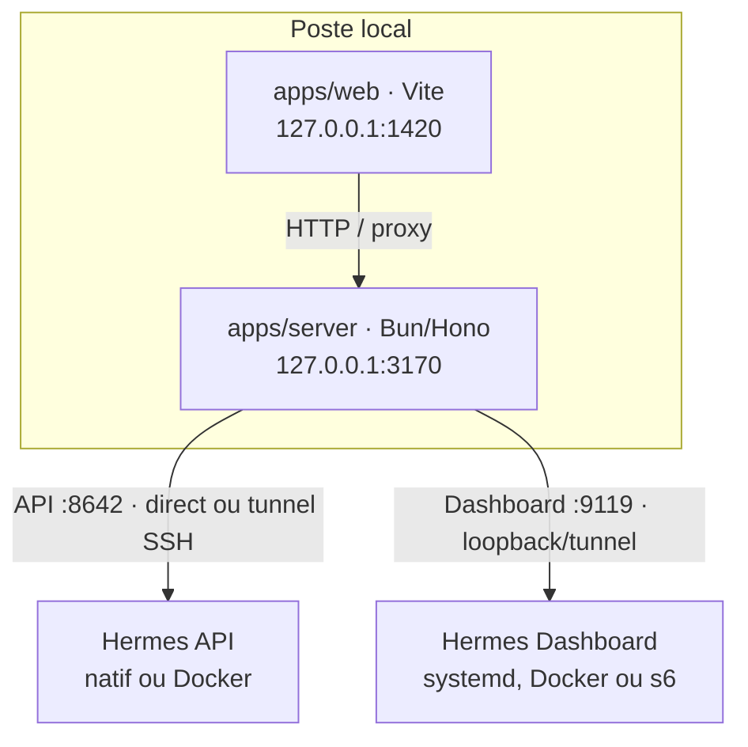

# Installation et utilisation — Hermes Console

Ce guide décrit les quatre topologies supportées par le projet :

1. Console locale + Hermes installé système sur la même machine ;
2. Console locale + Hermes Docker sur la même machine ;
3. Console locale + Hermes natif sur un VPS via tunnel SSH ;
4. Console locale + Hermes Docker sur un VPS via tunnel SSH.

Le mot « local » désigne toujours la Console (`apps/web` + `apps/server`). Le runtime Hermes
peut, lui, être local ou distant.

## Architecture et ports



Légende : le navigateur parle à Vite ; Vite proxifie `/api` vers Bun ; Bun parle à l’API Hermes
directement ou à travers un forward SSH. Le Dashboard est une seconde surface Hermes, utilisée
pour administrer les skills et les réglages : il écoute sur `:9119`, sans remplacer l’API `:8642`.
PostgreSQL est utilisé par `apps/server` pour les comptes, sites, agents, missions et sessions.

| Composant | Adresse de développement | Rôle |
|---|---:|---|
| Web Vite (`apps/web`) | `http://127.0.0.1:1420/` | interface et HMR |
| API Bun (`apps/server`) | `http://127.0.0.1:3170/` | API, auth, orchestration |
| Hermes local natif | `http://127.0.0.1:8642` | runtime sélectionné |
| Hermes Dashboard local | `http://127.0.0.1:9119` | gestion des skills et réglages |
| Hermes Docker local | `http://127.0.0.1:18642` | port hôte conseillé pour éviter `:8642` |

Ne pas utiliser `localhost` et `127.0.0.1` en alternance pour le parcours OAuth : ce sont deux
origines navigateur différentes. La configuration de développement du dépôt utilise
`http://127.0.0.1:1420`.

### Ouvrir ce guide pendant `make dev`

Le serveur `apps/server` expose ce fichier en lecture seule et `apps/web` le proxifie :

- [version via le Web Vite](http://127.0.0.1:1420/docs/installation-utilisation) ;
- [version Markdown via le Web Vite](http://127.0.0.1:1420/docs/installation-utilisation.md) ;
- [accès direct API](http://127.0.0.1:3170/docs/installation-utilisation.md).

## Prérequis communs

- Linux, macOS ou WSL2 ;
- Git, Bun et Docker ;
- PostgreSQL local, recommandé via le conteneur `infra-postgres` du poste ;
- un compte Google présent dans `GOOGLE_ALLOWED_EMAILS` ;
- un token `API_SERVER_KEY` Hermes ;
- pour un VPS : SSH, une clé connue dans `known_hosts` et le forwarding TCP autorisé.

Les commandes du projet utilisent Bun, jamais npm.

## Installer la Console

Depuis la racine du dépôt :

```bash
docker start infra-postgres
make setup
```

`make setup` installe les dépendances, crée `apps/server/.env.local` si nécessaire, vérifie
PostgreSQL et applique les migrations.

Renseigner ensuite au minimum dans `apps/server/.env.local` :

```dotenv
GOOGLE_CLIENT_ID=<client-id-google>
GOOGLE_CLIENT_SECRET=<secret-google>
GOOGLE_REDIRECT_URI=http://127.0.0.1:3170/api/auth?action=callback
CONSOLE_APP_ORIGIN=http://127.0.0.1:1420
GOOGLE_ALLOWED_EMAILS=<votre-email-google>
INSTALLATION_ADMIN_EMAILS=<votre-email-google>
```

Puis démarrer le mode développement :

```bash
make dev
```

Ouvrir **http://127.0.0.1:1420/**. Le port `3170` est l’API ; il peut servir un build compilé,
mais ce n’est pas l’URL Vite/HMR.

Après la première connexion Google, ouvrir `Paramètres → Runtime` et enregistrer la cible Hermes.
Le token est chiffré par `APP_ENCRYPTION_KEY` et n’est jamais placé dans l’URL.

## 1. Local + Hermes installé système

### Installer Hermes

L’installateur officiel installe la commande `hermes` et ses dépendances. Pour une installation
réellement système sous Linux (launcher dans `/usr/local/bin`) :

```bash
curl -fsSL https://hermes-agent.nousresearch.com/install.sh | sudo bash
```

Sans privilèges root, utilisez l’installation utilisateur et rendez ensuite son launcher
accessible au service qui exécute Hermes :

```bash
curl -fsSL https://hermes-agent.nousresearch.com/install.sh | bash
sudo ln -s "$HOME/.local/bin/hermes" /usr/local/bin/hermes
```

Pour une commande disponible globalement sur une machine Linux, l’installation root place le
launcher dans `/usr/local/bin/hermes`. Vérifier ensuite :

```bash
command -v hermes
hermes doctor
hermes --version
```

Configurer le fournisseur et le runtime :

```bash
hermes setup
# ou, pour un compte Nous Portal :
hermes setup --portal
```

### Activer l’API Hermes

Dans le fichier de configuration Hermes de l’utilisateur qui exécutera le service
(`~/.hermes/.env`, ou `$HERMES_HOME/.env`) :

```dotenv
API_SERVER_ENABLED=true
API_SERVER_HOST=127.0.0.1
API_SERVER_PORT=8642
API_SERVER_KEY=<token-long-et-aleatoire>
```

Démarrer Hermes :

```bash
hermes gateway
```

Pour un lancement persistant, utiliser un service systemd adapté à l’utilisateur et à son
`HERMES_HOME`. Le service doit conserver `PATH` contenant le chemin du launcher Hermes. C’est
important pour le bouton OAuth OpenAI Codex, qui lance la CLI depuis `apps/server`.

Créer aussi le service persistant du Dashboard, avec le même utilisateur et le même environnement
Hermes :

```bash
mkdir -p "$HOME/.config/systemd/user"
HERMES_BIN="$(command -v hermes)"
cat > "$HOME/.config/systemd/user/hermes-dashboard.service" <<EOF
[Unit]
Description=Hermes Dashboard
After=network-online.target

[Service]
ExecStart=$HERMES_BIN dashboard --host 127.0.0.1 --port 9119 --no-open
Restart=on-failure
RestartSec=2
Environment=HERMES_HOME=$HOME/.hermes

[Install]
WantedBy=default.target
EOF
systemctl --user daemon-reload
systemctl --user enable --now hermes-dashboard.service
loginctl enable-linger "$USER" 2>/dev/null || true
```

Vérifier les deux surfaces :

```bash
curl --fail --silent --show-error http://127.0.0.1:9119/api/status
systemctl --user status hermes-dashboard.service
```

Vérifier la cible :

```bash
curl --fail --silent --show-error http://127.0.0.1:8642/health
curl --fail --silent --show-error \
  -H "Authorization: Bearer $HERMES_RUNTIME_TOKEN" \
  http://127.0.0.1:8642/v1/capabilities
```

Dans la Console :

| Champ | Valeur |
|---|---|
| Transport | `Direct` |
| Base URL | `http://127.0.0.1:8642` |
| Token | valeur de `API_SERVER_KEY` |
| Dossier de travail | même chemin que le workdir Hermes |

## 2. Local + Hermes Docker

### Lancer le conteneur

Le port hôte `18642` évite de masquer une installation native sur `8642`. Le bind loopback
empêche une exposition réseau accidentelle :

```bash
mkdir -p "$HOME/.hermes-console-docker"
read -r -s -p "API_SERVER_KEY Hermes: " HERMES_API_KEY
printf '\n'
docker pull nousresearch/hermes-agent:latest
docker run -d \
  --name hermes-console-runtime-local \
  --restart unless-stopped \
  -v "$HOME/.hermes-console-docker:/opt/data" \
  -p 127.0.0.1:18642:8642 \
  -e API_SERVER_ENABLED=true \
  -e API_SERVER_HOST=0.0.0.0 \
  -e API_SERVER_PORT=8642 \
  -e API_SERVER_KEY="$HERMES_API_KEY" \
  nousresearch/hermes-agent gateway run
docker run -d \
  --name hermes-console-dashboard-local \
  --restart unless-stopped \
  --network host \
  -v "$HOME/.hermes-console-docker:/opt/data" \
  nousresearch/hermes-agent dashboard --host 127.0.0.1 --port 9119 --no-open
unset HERMES_API_KEY
```

Le bind `0.0.0.0` est nécessaire à l’intérieur du conteneur ; le bind publié sur l’hôte reste
`127.0.0.1`. Pour une installation reproductible, remplacer `:latest` par un digest d’image
validé par l’équipe. Le Dashboard est un conteneur compagnon distinct : son `restart unless-stopped`
le rend persistant sans donner à Hermes le socket Docker.

Vérifier :

```bash
docker ps --filter name=hermes-console-runtime-local
curl --fail --silent --show-error http://127.0.0.1:18642/health
curl --fail --silent --show-error http://127.0.0.1:9119/api/status
```

Dans la Console, configurer :

```text
Transport : Direct
Base URL  : http://127.0.0.1:18642
Token     : API_SERVER_KEY du conteneur
```

Pour les pièces jointes et artefacts, monter un workdir hôte explicite dans le conteneur et
utiliser le même chemin côté Console :

```bash
mkdir -p /tmp/hermes-console-work
docker run ... -v /tmp/hermes-console-work:/tmp/hermes-console-work ...
```

Puis définir `HERMES_SHARED_WORKDIR=/tmp/hermes-console-work` dans la Console.

## 3. Local + Hermes natif sur un VPS

### Préparer Hermes sur le VPS

Sur le VPS, installer Hermes avec l’installateur officiel en mode système puis activer son API
uniquement sur loopback :

```bash
curl -fsSL https://hermes-agent.nousresearch.com/install.sh | sudo bash
hermes setup
```

Dans `$HERMES_HOME/.env` :

```dotenv
API_SERVER_ENABLED=true
API_SERVER_HOST=127.0.0.1
API_SERVER_PORT=8642
API_SERVER_KEY=<token-du-runtime-distant>
```

Démarrer le service Hermes avec l’utilisateur distant :

```bash
systemctl --user enable --now hermes-gateway.service
systemctl --user status hermes-gateway.service
ss -lntp | grep ':8642'
```

Installer également `hermes-dashboard.service` avec le même utilisateur, comme dans le scénario
local natif, puis vérifier `systemctl --user status hermes-dashboard.service` et `ss -lntp | grep
':9119'`. Le tunnel SSH de la Console forwarde séparément `127.0.0.1:8642` et `127.0.0.1:9119`.

Le VPS doit autoriser le forwarding SSH (`AllowTcpForwarding yes`). Le port Hermes ne doit pas
être publié sur `0.0.0.0`.

Tester depuis le VPS lui-même :

```bash
curl --fail --silent --show-error http://127.0.0.1:8642/health
```

### Configurer la Console

Dans `Paramètres → Runtime`, sélectionnez `Tunnel SSH`. Le parcours sépare maintenant clairement
la connexion et le dossier de travail :

1. choisir l’alias ou l’hôte SSH, scanner sa clé puis comparer l’empreinte hors bande ;
2. saisir l’utilisateur, l’URL Hermes vue depuis le VPS et les secrets nécessaires ;
3. cliquer sur `Tester et enregistrer` : rien n’est sauvegardé avant les preuves SSH,
   `/health` et `/v1/capabilities` ;
4. cliquer sur `Rechercher sur le VPS` pour détecter Hermes natif ou Docker, `terminal.cwd` et
   les bind mounts disponibles ;
5. choisir un dossier proposé, ou vérifier manuellement les chemins vus par le VPS et par Hermes ;
6. confirmer l’activation après les tests d’écriture SFTP et dans le contexte réel d’Hermes.

La section `Installation ou réparation` reste optionnelle. Le provisioning Docker utilise une image
épinglée par digest. Le provisioning natif automatique reste bloqué tant qu’une release officielle
avec checksum vérifiable n’est pas intégrée ; une installation native existante peut néanmoins être
connectée, détectée et utilisée par le parcours principal.

Pour un compte SSH non root, le wizard exige un `sudo` non interactif. Le mode clé/agent
utilise le binaire `ssh`, `~/.ssh/config`, `ssh-agent` et `ProxyJump` sans importer de clé privée.

Les valeurs attendues restent :

| Champ | Valeur |
|---|---|
| Transport | `Tunnel SSH` |
| Hôte SSH | nom ou IP du VPS |
| Utilisateur SSH | utilisateur de service autorisé |
| Port SSH | `22` ou port réel |
| Authentification | agent, clé configurée ou mot de passe |
| Base URL Hermes | `http://127.0.0.1:8642` |
| Token | `API_SERVER_KEY` du VPS |
| Workdir distant | chemin réel du workdir Hermes sur le VPS |

Le `127.0.0.1` de la Base URL est celui du VPS, pas celui du poste local. La Console crée le
forward côté serveur et utilise le même canal pour le SFTP des fichiers.

Valider ensuite avec le bouton de test runtime ou :

```bash
HERMES_TRANSPORT=ssh \
HERMES_BASE_URL=http://127.0.0.1:8642 \
HERMES_RUNTIME_TOKEN='<token>' \
HERMES_SSH_HOST='<vps>' \
HERMES_SSH_USER='<user>' \
bun run runtime:probe
```

### Migration d'un volume Docker vers un bind mount

Ne configurez jamais la Console avec un chemin sous
`/var/lib/docker/volumes/.../_data`. Ce répertoire appartient à l’implémentation interne de Docker ;
il n’est ni une interface stable ni un déploiement déclaratif. La cible prise en charge est :

~~~text
╔════════════ Console locale ════════════╗
║ ┌────────────────────────────────────┐ ║
║ │ Runtime, journal et workspace      │ ║
║ └─────────────────┬──────────────────┘ ║
╚═══════════════════│════════════════════╝
                    │ SSH · SFTP · progression SSE
                    ▼
╔════════════════════ VPS ═══════════════════════════════════╗
║ ┌──────────────────────────────┐  bind mount RW            ║
║ │ /srv/hermes-console/data     │──────────────────────┐    ║
║ │ └─ workspace                 │                      ▼    ║
║ └──────────────────────────────┘       ┌─────────────────┐ ║
║                                        │ /opt/data       │ ║
║ ┌──────────────────────────────┐       │ conteneur Hermes│ ║
║ │ volume + conteneur rollback  │◀──────│ :8642 loopback  │ ║
║ └──────────────────────────────┘ garde └─────────────────┘ ║
╚════════════════════════════════════════════════════════════╝
~~~

Légende : SSH pilote Docker et SFTP prouve le chemin hôte ; le bind mount expose les mêmes octets à
Hermes. Composants : Console Hono, journal PostgreSQL, stockage durable du VPS, runtime Hermes et
copie de rollback.

Après `Rechercher sur le VPS`, la carte `Migrer le stockage Docker` apparaît pour un volume nommé.
La Console automatise uniquement une topologie reconnue et bornée : utilisateur SSH `root`,
conteneur unique `hermes-console-runtime`, volume local monté uniquement sur `/opt/data`, image
Hermes épinglée par digest, réseau bridge, publication `127.0.0.1:8642`, politique
`unless-stopped`, Docker Compose disponible, chemins cibles absents ou vides et espace disque
suffisant. Toute personnalisation sort de ce périmètre et affiche le guide manuel au lieu de tenter
une mutation approximative.

Le bouton `Préparer la migration` reste en lecture seule. Il inventorie la source, vérifie Hermes,
affiche la taille, le nombre de fichiers, le digest, les chemins, les avertissements et la phrase de
confirmation. Le plan et le job actifs sont journalisés : recharger la route SSH reprend la
confirmation ou le flux de progression au lieu de perdre l’opération. Après confirmation, la Console :

1. bloque le démarrage de nouvelles missions et reprend l’opération au redémarrage si nécessaire ;
2. crée `/srv/hermes-console/data`, `/srv/hermes-console/backups/<migration>` et
   `/opt/hermes-console-runtime` avec des permissions root-only ;
3. arrête Hermes, archive tout `/opt/data`, copie avec conservation des propriétaires, modes et
   dates, puis compare les manifestes SHA-256 source et cible ;
4. renomme l’ancien conteneur sans supprimer son volume et démarre le nouveau déploiement Compose
   avec le même digest et la même clé `API_SERVER_KEY` ;
5. attend jusqu'à 60 secondes le démarrage borné du gateway, puis vérifie le bind mount, `/health`,
   `/v1/capabilities`, le tunnel, SFTP et une écriture depuis Hermes ;
6. persiste seulement alors le workspace hôte `/srv/hermes-console/data/workspace` correspondant à
   `/opt/data/workspace` dans Hermes.

En cas d’échec après l’arrêt, le nouveau conteneur est retiré, l’ancien retrouve son nom et redémarre
sur le volume nommé. Un état distant ambigu devient `récupération requise` et les missions restent
bloquées. Le volume, le conteneur renommé et l’archive ne doivent être supprimés qu’après une mission
réelle, un artefact relu par SFTP et une sauvegarde externe validée.

Pour une installation personnalisée, appliquez le même ordre manuellement : préflight sans écriture,
arrêt, archive, copie avec métadonnées, comparaison des manifestes, conservation de l’ancien
conteneur, recréation avec `--mount type=bind,src=/srv/hermes-console/data,dst=/opt/data`, puis preuves
Hermes et SFTP. Si une étape échoue, redémarrez immédiatement l’ancien conteneur ; ne supprimez ni le
volume source ni l’archive. La Console pourra ensuite vérifier et activer les deux chemins depuis la
même route.

Le fichier géré `/opt/hermes-console-runtime/compose.yml` référence un digest immuable et charge
`runtime.env` en mode `0600`. Une mise à jour future consiste à sauvegarder, remplacer uniquement le
digest, exécuter `docker compose up -d`, refaire toutes les sondes, puis conserver temporairement
l’ancien digest et le stockage de rollback. La migration de stockage ne tourne pas automatiquement
la clé API ; cette rotation reste une opération de sécurité séparée.

## 4. Local + Hermes Docker sur un VPS

### Déployer Hermes sur le VPS

Sur le VPS, le conteneur écoute en loopback sur le port `8642` :

```bash
mkdir -p "$HOME/.hermes-console-docker"
read -r -s -p "API_SERVER_KEY Hermes VPS: " HERMES_API_KEY
printf '\n'
docker pull nousresearch/hermes-agent:latest
docker run -d \
  --name hermes-console-runtime \
  --restart unless-stopped \
  -v "$HOME/.hermes-console-docker:/opt/data" \
  -p 127.0.0.1:8642:8642 \
  -e API_SERVER_ENABLED=true \
  -e API_SERVER_HOST=0.0.0.0 \
  -e API_SERVER_PORT=8642 \
  -e API_SERVER_KEY="$HERMES_API_KEY" \
  nousresearch/hermes-agent gateway run
docker run -d \
  --name hermes-console-dashboard \
  --restart unless-stopped \
  --network host \
  -v "$HOME/.hermes-console-docker:/opt/data" \
  nousresearch/hermes-agent dashboard --host 127.0.0.1 --port 9119 --no-open
unset HERMES_API_KEY
```

Vérifier sur le VPS :

```bash
docker inspect -f '{{.State.Status}} {{.HostConfig.RestartPolicy.Name}}' hermes-console-runtime
curl --fail --silent --show-error http://127.0.0.1:8642/health
docker inspect -f '{{.State.Status}} {{.HostConfig.RestartPolicy.Name}}' hermes-console-dashboard
curl --fail --silent --show-error http://127.0.0.1:9119/api/status
```

### Configurer la Console

Utiliser exactement la configuration SSH du scénario 3 :

```text
Transport       : Tunnel SSH
Hôte SSH        : <vps>
Utilisateur SSH : <user>
Base URL Hermes  : http://127.0.0.1:8642
Token            : API_SERVER_KEY du conteneur VPS
Workdir distant : chemin monté dans /opt/data ou le workdir configuré
```

Ne pas mettre `http://<ip-du-vps>:8642` dans la Base URL si le service est lié à loopback. Le
tunnel doit joindre `127.0.0.1:8642` depuis le VPS.

Le provisioning Docker de la Console prépare également `hermes-console-dashboard` sur
`127.0.0.1:9119` avec `restart unless-stopped` et un bind loopback. Dans `Paramètres → Runtime`, la carte Dashboard
permet ensuite de vérifier, démarrer ou redémarrer uniquement cette surface ; Hermes API et les
missions ne sont pas redémarrés. Dans `Skills`, le bouton switch devient disponible lorsque la
sonde Dashboard est opérationnelle. Les changements de skills prennent effet à la prochaine
session Hermes.

Pour la topologie Compose gérée, ne publiez pas un Dashboard lié à `0.0.0.0` sans provider
d’authentification Hermes. Utilisez un provider Basic/OAuth déclaré dans la configuration Hermes,
ou gardez le Dashboard sur loopback et gérez-le depuis un hôte qui peut ouvrir le tunnel SSH.

## Vérification commune

Après chaque configuration runtime :

1. vérifier `/health` et `/v1/capabilities` ;
2. cliquer sur le test runtime dans la Console ;
3. créer un agent dans `/agents/new` ;
4. créer une mission dans `/runs/new` ;
5. vérifier les événements SSE et les artefacts dans le workdir attendu.

La sonde locale ne journalise pas les secrets :

```bash
HERMES_BASE_URL=http://127.0.0.1:8642 \
HERMES_RUNTIME_TOKEN='<secret>' \
bun run runtime:probe
```

## Dépannage rapide

| Symptôme | Vérification |
|---|---|
| `hermes: command not found` | `command -v hermes`, puis définir `HERMES_CLI_PATH` pour le service Console |
| `401` sur Hermes | vérifier `API_SERVER_KEY` et le token enregistré dans Paramètres → Runtime |
| SSH `forwarding refused` | activer `AllowTcpForwarding yes` et vérifier `sshd_config` |
| `/health` répond mais pas les missions | vérifier `/v1/capabilities`, le provider Hermes et son setup |
| fichiers absents | aligner `HERMES_SHARED_WORKDIR` et le montage Docker/workdir distant |
| écran blanc sur `:3170` en développement | utiliser `http://127.0.0.1:1420/` avec `make dev` |
| OAuth boucle ou perd la session | utiliser partout `127.0.0.1`, pas un mélange avec `localhost` |

## Sources Hermes officielles

- [Installation Hermes Agent](https://github.com/NousResearch/hermes-agent/blob/main/website/docs/getting-started/installation.md)
- [API server Hermes](https://github.com/NousResearch/hermes-agent/blob/main/website/docs/user-guide/features/api-server.md)
- [Exécution Hermes avec Docker](https://github.com/NousResearch/hermes-agent/blob/main/website/docs/user-guide/docker.md)
